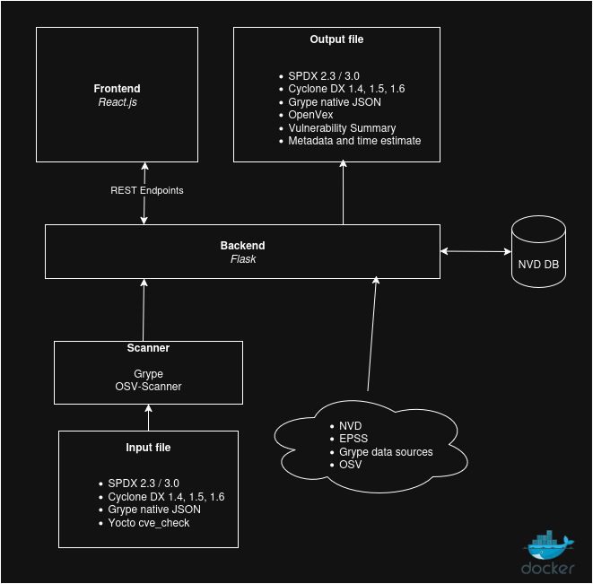

= VulnScout
Savoir-faire Linux
v0.6.0, {docdate}: developement builds
:url-repo: https://github.com/savoirfairelinux/vulnscout
:source-highlighter: highlight.js
:toc:

== Introduction

=== What is VulnScout?

VulnScout is a tool designed to help developers and security analysts identify vulnerabilities in their software components and dependencies using an SBOM (Software Bill of Materials). Rather than analyzing code or binaries directly, VulnScout examines metadata that lists all components and dependencies in your codebase. It supports popular input formats such as SPDX, CycloneDX, Grype JSON, and Yocto JSON.

It pulls known vulnerabilities from public sources like the NVD, EPSS, and Grype to figure out which parts of your codebase might be affected by security issues (CVE). You can use it locally through a web interface that provides visualization tools or command line that generates enriched output files.

=== What can VulnScout do?

* Analyze SBOMs: Parses and merges SBOMs from multiple formats (SPDX, CycloneDX, Grype JSON and Yocto cve_check output).
* Detect vulnerabilities: Associates packages with known CVEs from multiple sources (e.g., NVD, EPSS, Grype and OSV).
* Enrich SBOM files: Combines vulnerability data found in the input files with data pulled from external sources.
* Generate detailed reports: Provides scan summaries in multiple formats, including an interactive web dashboard and text file.
* Help track fixes: The web dashboard allows you to assign and track which vulnerabilities are fixed and which are still open and provides various metrics to help decision-making (score, exploitability, risk exposure...).

=== Architecture

=== Terminology

This document use a lot of format names, accronyms and abbreviations which is evident for people working on them, but not for everyone. Here is a definition of the most used ones:

[unordered]
CVE:: Common Vulnerabilities and Exposures. Most (but not all) vulnerabilities discovered by a security researcher are assigned a CVE number. This number is unique and is used to reference the vulnerability in various databases.
SBOM:: Software Bill of Materials. A list of all the components used in a software project. This list can be used to track dependencies, licenses, and vulnerabilities.
SPDX:: Software Package Data Exchange. A standard format for SBOMs developed by the Linux Foundation. Mostly found as JSON or XML files.
CDX:: Cyclone DX. A standard format for SBOMs developed as an OWASP project. Mostly found as JSON or XML files.
Yocto:: A build system for embedded Linux systems. It is used to build custom Linux distributions for embedded systems.

<<<

== Features

You can use VulnScout to scan your project, make report about your dependencies and vulnerabilities, and to manage them.

=== Supported input formats

* SPDX 2.3 (Packages)
* ##Draft##: SPDX 3.0 (Packages + vulnerabilities)
* Cyclone DX 1.4, 1.5, 1.6 (Packages + vulnerabilities)
* Grype native JSON format (Packages + vulnerabilities)
* Yocto JSON output of `cve-check` module (Packages + vulnerabilities)

=== Supported output formats

* SPDX 2.3 (Packages)
* ##Draft##: SPDX 3.0 (Packages + vulnerabilities)
* Cyclone DX 1.4, 1.5, 1.6 (Packages + vulnerabilities)
* openVex (vulnerabilities + Assessments)

=== Vulnerability Data Sources

The tool pulls vulnerability and risk data from multiple trusted sources:

* NVD (National Vulnerability Database)
* All datasource supported by Grype
* EPSS (Exploit Prediction Scoring System)
* ##OSV## (Open Source Vulnerabilities) Comming soon
* Information embedded in inputs files

== Getting Started with VulnScout

VulnScout is designed to run locally in a docker container.

=== Recommended Setup: Using the `vulnscout.sh` Wrapper

==== 1. Copy the wrapper script

Place the `bin/vulnscout.sh` file into the root directory of your project repository:

[source,shell]
----
cp bin/vulnscout.sh .
----

==== 2. Set up configuration

Configuration files allows you to tell VulnScout where to find your SBOM files and how to run the scanner. You can use the provided example configuration files and modify them to suit your needs.

Create the configuration directory and copy an example config file:

[source,shell]
----
mkdir .vulnscout/
# A generic configuration file with generic SBOM inputs
cp bin/.vulnscout-example/generic.rc .vulnscout/
# A configuration file with path to Yocto projects cve-check output
cp bin/.vulnscout-example/yocto.rc .vulnscout/
----

Edit the configuration file in `.vulnscout/` to suit your project’s needs.

==== 3. Run the scanner

From the root of your project, run:

[source,shell]
----
./vulnscout.sh scan
----

Once the scan completes, you can open the VulnScout dashboard in your web browser to view the results:

[source,plaintext]
----
http://localhost:7275
----

==== Troubleshooting

If the container fails to start, it may be due to missing Docker credentials. Log in with:

[source,shell]
----
docker login
----

Refer to the <<Authentication>> section for more details.

=== Alternative Setup: Build and Use a Local Image

==== 1. Build the Docker image

From the root of the repository, build the local image:

[source,shell]
----
BUILD_TAG="local-build" cqfd -b docker_build run
----

This will produce a Docker image tagged `vulnscout:local-build`.

==== 2. Prepare the project repository

Copy the wrapper script and configuration:

[source,shell]
----
cp bin/vulnscout.sh .
mkdir .vulnscout/
# A generic configuration file with generic SBOM inputs
cp bin/.vulnscout-example/generic.rc .vulnscout/
# A configuration file with path to Yocto projects cve-check output
cp bin/.vulnscout-example/yocto.rc .vulnscout/
----

Then edit the copied `.rc` file inside `.vulnscout/`:

- Update paths as needed.
- Set the `DOCKER_IMAGE` variable to use your local image:

==== 3. Run the scanner

From the root of your project, run:

[source,shell]
----
./vulnscout.sh scan
----

Once the scan completes, you can open the VulnScout dashboard in your web browser to view the results:

[source,plaintext]
----
http://localhost:7275
----

=== Alternative Setup: Use `docker-compose`

==== 1. Copy the Compose template

Copy the provided Docker Compose template into your project root location:

[source,shell]
----
cp docker-compose.template.yml docker-compose.yml
----

==== 2. Configure your Compose file

Edit `docker-compose.yml` to:

- Bind your project volumes
- Set appropriate environment variables  
  (see instructions in the file)

==== 3. Start the scanner

Run the following command from your project root:

[source,shell]
----
docker-compose up
----

Then access the results at:

[source,plaintext]
----
http://localhost:7275
----

== Specific Configuration

=== Configuration for Yocto projects

After completing one of the <<Deployment>> tutorials, follow these steps to configure your Yocto project to generate the necessary files for scanning.

[TIP]
====
CycloneDX is not mandatory to use VulnScout.  
If you only want to use SPDX and Yocto’s native CVE-checker, you can skip steps 1–3, and in step 4, ignore the `cyclonedx-export` line.
====

==== 1. Recommended setup: Add `meta-cyclonedx` submodule

If your Yocto project uses Git submodules, run this from the root of your Yocto repository:

[source,shell]
----
git submodule add https://github.com/savoirfairelinux/meta-cyclonedx.git sources/meta-cyclonedx
----

If you have a `.gitmodules` file, this is the preferred method.

==== 2. Alternative setup: Clone without submodules

If you don't want to use submodules, manually clone the layer:

[source,shell]
----
cd sources
git clone https://github.com/savoirfairelinux/meta-cyclonedx.git
----

==== 3. Checkout the appropriate tag

You need to grab the meta-cyclonedx tag that matches your Yocto version.
[source,shell]
----
cd sources/meta-cyclonedx
git checkout <tag-for-your-yocto-version>
----

Replace `<tag-for-your-yocto-version>` with your Yocto release.

==== 4. Update `conf/local.conf`

Append the following lines to your `conf/local.conf` file if they are not already present:

[source,conf]
----
INHERIT += "create-spdx"             // SPDX file generation
INHERIT += "cyclonedx-export"        // CycloneDX SBOM export
INHERIT += "cve-check"               // Native CVE checker
include conf/distro/include/cve-extra-exclusions.inc
----

Now rebuild your Yocto project to generate SPDX, CycloneDX (CDX), and CVE data.

==== 5. Configure VulnScout

Make sure you have a `.rc` file configured in your `.vulnscout` folder.  
If you haven't already, refer to the example file:

[source,shell]
----
cp bin/.vulnscout-example/yocto.rc .vulnscout/
----

Update it to reflect your build paths and desired settings.

=== Configuration tips for others projects

You don’t need to use Yocto to benefit from VulnScout.  
All you need is at least one Software Bill of Materials (SBOM) file in SPDX or CycloneDX format.

Grype and OSV scanners will analyze the SBOM for known vulnerabilities.  
If your SBOMs already include vulnerabilities, those will also be merged into the final results.

If you followed the <<Deployment>> section, you should already have a `.vulnscout` folder in your project root.

==== Tips for Editing your `.rc` File

[TIP]
====
- You can remove the `YOCTO_CVE` variable if not using Yocto.
- The `SPDX_FILES` and `CDX_FILES` variables accept multiple files or folders as Bash arrays.
- `.tar`, `.tar.gz`, and `.tar.zst` archives are supported as SBOM inputs.
- To ignore parsing errors for malformed SBOMs, set:
  `IGNORE_PARSING_ERRORS=true`
====

==== Run the scanner

Run the following to start scanning:

[source,shell]
----
./vulnscout.sh scan
----

Then open your browser to view the results:

[source,plaintext]
----
http://localhost:7275
----

<<<

include::README_DEV.adoc[]
