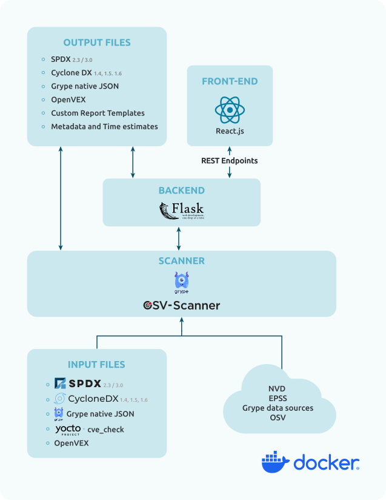

= VulnScout
Savoir-faire Linux
:url-repo: https://github.com/savoirfairelinux/vulnscout
:source-highlighter: highlight.js

image::./doc/images/vulnscout_logo.jpeg[alt=vulnscout logo]

image::https://img.shields.io/badge/License-GPL%203.0-green.svg[License, link=https://opensource.org/license/gpl-3-0]

---

== :small_blue_diamond:  Introduction

VulnScout is designed to analyse and identify vulnerabilities in their software components and dependencies using an *SBOM* (Software Bill Of Materials).

It pulls known vulnerabilities from public sources like the NVD, EPSS, and Grype to figure out which parts of a codebase might be affected by security issues (CVE).

VulnScout also provides a web interface for visualisation and a command line to generate enriched output files.

=== VulnScout Features

* Analyse SBOMs
* Detect vulnerabilities
* Enrich SBOM files
* Generate detailed reports
* Help track fixes with the dashboard

==  :wrench: Setting up VulnScout

=== Requirements & Installation

VulnScout is designed to run locally in a Docker container.
It will require having `docker-compose` or `docker compose` available on your host.

If you need to install `docker compose`, look at:
https://docs.docker.com/compose/install/[docker-compose]

To install VulnScout, you only need to clone the repository:
[source,bash]
----
git clone https://github.com/savoirfairelinux/vulnscout.git
cd vulnscout
----

==  :penguin: Using VulnScout

===  Run VulnScout demo

This project contains a default usable example of VulnScout.
To use it, you can simply run the default script with the command:

[source,shell]
----
./start-example.sh
----

Or, if you prefer to run another example based on SPDX-3.0, you can use the following command:

[source,shell]
----
./start-example.sh --spdx3
----
These commands will use the docker-compose files located here: _/.vulnscout/example/_

===  Run VulnScout with Yocto

We have a dedicated layer for VulnScout integration in Yocto.

You can find the layer here: https://github.com/savoirfairelinux/meta-vulnscout

To be short, a simple `inherit vulnscout` in your image recipe will be enough to configure vulnscout for your project.

The vulnscout web interface can be started with a `bitbake <image-recipe> -c vulnscout` command.

=== Run VulnScout manually

To use VulnScout manually, you can use the script `vulnscout.sh` provided in the repository.

For example, to reconfigure the default example SPDX3, you can run:

[source,shell]
----
./vulnscout.sh --name demo --sbom $(pwd)/.vulnscout/example-spdx3/input/core-image-minimal-qemux86-64.rootfs.spdx.json \
--cve-check $(pwd)/.vulnscout/example-spdx3/input/core-image-minimal-qemux86-64.rootfs.json
----

Then, if you want to use the CI mode, without the web interface, you can the command with the `--fail_condition` argument:

[source,shell]
----
./vulnscout.sh --name demo --sbom $(pwd)/.vulnscout/example-spdx3/input/core-image-minimal-qemux86-64.rootfs.spdx.json \
--cve-check $(pwd)/.vulnscout/example-spdx3/input/core-image-minimal-qemux86-64.rootfs.json \
--fail_condition "cvss >= 9.0 or (cvss >= 7.0 and epss >= 50%)"
----

===  Run VulnScout with docker

You can start the VulnScout docker container with a `docker compose` or `docker-compose` command:

[source,bash]
----
docker compose -f </path/to/yaml> up
----

Then open your browser to view the results:

[source,plaintext]
----
http://localhost:7275
----

==== Configuration tips for other projects

To use VulnScout, you only need a Software Bill of Materials *(SBOM)* file in SPDX or CycloneDX format. +
The Grype scanner will analyse the SBOM for vulnerabilities; if it already includes some, those will be merged into the final results. +
To do so, create a new sub-folder in _.vulnscout_ and place a modified `yaml` using your configuration. +
To configure your `yaml` file, you can look at the example provided here _.vulnscout/example/docker-example.yml_

===== Tips for Editing your `yaml` file

[TIP]
====
- .tar, .tar.gz, .tar.zst, and archives are supported as SPDX 2 input.
- .spdx files (tag-value format) are supported as SPDX 2 input.
- .spdx.json is supported as SPDX 3 input.
- To ignore parsing errors for malformed SBOMs, set: `IGNORE_PARSING_ERRORS=true`
====

== :mag_right: Architecture

=== :inbox_tray: Supported input files

* SPDX 2.3 (Packages) - JSON and tag-value formats
* SPDX 3.0 (Packages + vulnerabilities)
* Cyclone DX 1.4, 1.5, 1.6 (Packages + vulnerabilities)
* Grype native JSON format (Packages + vulnerabilities)
* Yocto JSON output of `cve-check` module (Packages + vulnerabilities)

=== :outbox_tray: Supported output files

* SPDX 2.3 (Packages)
* SPDX 3.0 (Packages + vulnerabilities)
* Cyclone DX 1.4, 1.5, 1.6 (Packages + vulnerabilities)
* openVex (vulnerabilities + assessments)
* All reports: Asciidoc, HTML, PDF
* Summary: Asciidoc, HTML, PDF
* Time estimates: csv
* Vulnerabilities: csv, txt

=== :bar_chart: Vulnerability Data Sources

.The tool pulls vulnerability and risk data from multiple trusted sources:

* NVD (National Vulnerability Database)
* All data sources supported by Grype
* EPSS (Exploit Prediction Scoring System)
* ##OSV (Open Source Vulnerabilities) Coming soon##
* Information embedded in input files

=== :pencil: Custom CVSS Scoring

VulnScout allows you to add a custom CVSS vector string to a vulnerability, enabling organisation-specific vulnerability scoring.

== :clipboard: Licence

`Copyright (C) 2017-2025 Savoir-faire Linux, Inc.` +
VulnScout is released under the GPL-3.0 license.

