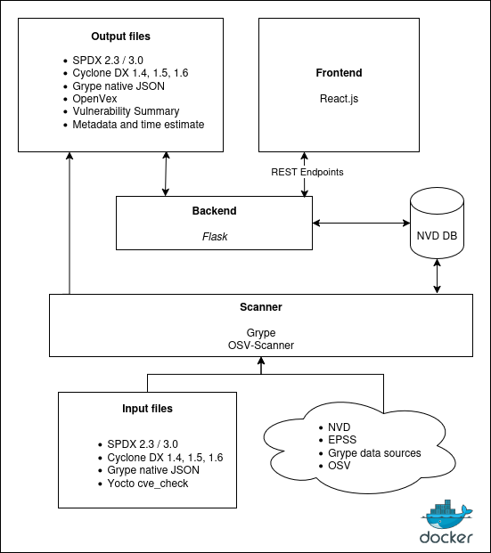

= VulnScout
Savoir-faire Linux
v0.7.0, {docdate}: developement builds
:url-repo: https://github.com/savoirfairelinux/vulnscout
:source-highlighter: highlight.js
:toc:

image::https://img.shields.io/badge/License-GPL%203.0-green.svg[License, link=https://opensource.org/license/gpl-3-0]

== Introduction

=== What is VulnScout?

VulnScout is a tool designed to help developers and security analysts identify vulnerabilities in their software components and dependencies using an SBOM (Software Bill of Materials). Rather than analyzing code or binaries directly, VulnScout examines metadata that lists all components and dependencies in your codebase. It supports popular input formats such as SPDX, CycloneDX, Grype JSON, and Yocto JSON.

It pulls known vulnerabilities from public sources like the NVD, EPSS, and Grype to figure out which parts of your codebase might be affected by security issues (CVE). You can use it locally through a web interface that provides visualization tools or command line that generates enriched output files.

=== What can VulnScout do?

* Analyze SBOMs: Parses and merges SBOMs from multiple formats (SPDX, CycloneDX, Grype JSON and Yocto cve_check output).
* Detect vulnerabilities: Associates packages with known CVEs from multiple sources (e.g., NVD, EPSS, Grype and OSV).
* Enrich SBOM files: Combines vulnerability data found in the input files with data pulled from external sources.
* Generate detailed reports: Provides scan summaries in multiple formats, including an interactive web dashboard and text file.
* Help track fixes: The web dashboard allows you to assign and track which vulnerabilities are fixed and which are still open and provides various metrics to help decision-making (score, exploitability, risk exposure...).
* Help track licenses: The web dashboard provides insights into the licenses of the components in your codebase and helps ensure compliance.

=== Architecture

=== Terminology

This document use a lot of format names, accronyms and abbreviations which is evident for people working on them, but not for everyone. Here is a definition of the most used ones:

[unordered]
CVE:: Common Vulnerabilities and Exposures. Most (but not all) vulnerabilities discovered by a security researcher are assigned a CVE number. This number is unique and is used to reference the vulnerability in various databases.
SBOM:: Software Bill of Materials. A list of all the components used in a software project. This list can be used to track dependencies, licenses, and vulnerabilities.
SPDX:: Software Package Data Exchange. A standard format for SBOMs developed by the Linux Foundation. Mostly found as JSON or XML files.
CDX:: Cyclone DX. A standard format for SBOMs developed as an OWASP project. Mostly found as JSON or XML files.
Yocto:: A build system for embedded Linux systems. It is used to build custom Linux distributions for embedded systems.

== Features

You can use VulnScout to scan your project, make report about your dependencies and vulnerabilities, and to manage them.

=== Supported input formats

* SPDX 2.3 (Packages)
* SPDX 3.0 (Packages + vulnerabilities)
* Cyclone DX 1.4, 1.5, 1.6 (Packages + vulnerabilities)
* Grype native JSON format (Packages + vulnerabilities)
* Yocto JSON output of `cve-check` module (Packages + vulnerabilities)

=== Supported output formats

* SPDX 2.3 (Packages)
* SPDX 3.0 (Packages + vulnerabilities)
* Cyclone DX 1.4, 1.5, 1.6 (Packages + vulnerabilities)
* openVex (vulnerabilities + Assessments)

=== Vulnerability Data Sources

The tool pulls vulnerability and risk data from multiple trusted sources:

* NVD (National Vulnerability Database)
* All datasource supported by Grype
* EPSS (Exploit Prediction Scoring System)
* ##OSV## (Open Source Vulnerabilities) Comming soon
* Information embedded in inputs files

== Getting Started with VulnScout

VulnScout is designed to run locally in a Docker container.
It will require having `docker-compose` or `docker compose` available on your host.

If you need to install `docker compose`, look at: https://docs.docker.com/compose/install/

=== Run Vulnscout project example

This project contains a default usable example of Vulnscout. 
To use it, you can simply run the default script with the command:

[source,shell]
----
./start-example.sh
----

==== Use Vulnscount with Yocto

We have a dedicated layer for Vulnscout integration in Yocto.

You can find the layer here: https://github.com/savoirfairelinux/meta-vulnscout

To be short, a simple `inherit vulnscout` in your image recipe will be enough to configure vulnscout for your project.

The vulnscout web interface can be started with a `bitbake <image-recipe> -c vulnscout` command.

=== Configuration tips for others projects

You don’t need to use Yocto to benefit from VulnScout.  
All you need is at least one Software Bill of Materials (SBOM) file in SPDX or CycloneDX format.

Grype and OSV scanners will analyze the SBOM for known vulnerabilities.  
If your SBOMs already include vulnerabilities, those will also be merged into the final results.

You can simply create a new sub-folder in .vulnscout and place a modified `yaml` using your configuration. 

To configure your `yaml` file, you can look at the example provided in `.vulnscout/example/docker-example.yml`.

==== Tips for Editing your `yaml` File

[TIP]
====
- `.tar`, `.tar.gz`, and `.tar.zst` archives are supported as SBOM inputs.
- To ignore parsing errors for malformed SBOMs, set:
  `IGNORE_PARSING_ERRORS=true`
====

Once it is done, you can run the new custom configuration with a `docker compose` command:

[source,shell]
----
docker compose -f /path/to/yaml up
----

Then open your browser to view the results:

[source,plaintext]
----
http://localhost:7275
----

==== License

`Copyright (C) 2017-2025 Savoir-faire Linux, Inc.`

Vulnscout is released under the GPL-3.0 license.