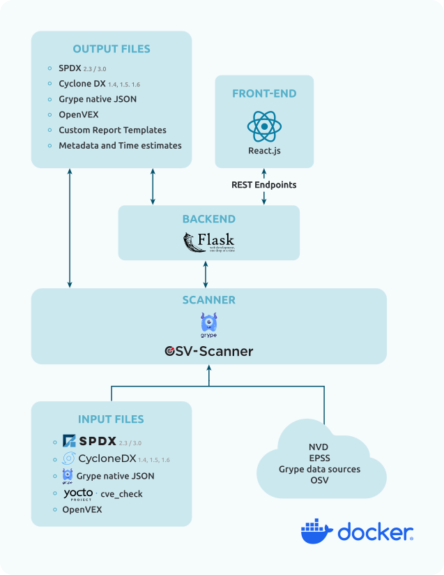

= VulnScout
Savoir-faire Linux
:url-repo: https://github.com/savoirfairelinux/vulnscout
:source-highlighter: highlight.js

image::./doc/images/vulnscout_logo.jpeg[alt=vulnscout logo]

image::https://img.shields.io/badge/License-GPL%203.0-green.svg[License, link=https://opensource.org/license/gpl-3-0]

---

== :small_blue_diamond:  Introduction

VulnScout is designed to analyse and identify vulnerabilities in their software components and dependencies using an *SBOM* (Software Bill Of Materials).

It pulls known vulnerabilities from public sources like the NVD, EPSS, and Grype to figure out which parts of a codebase might be affected by security issues (CVE).

VulnScout also provides a web interface for visualisation and a command line to generate enriched output files.

=== VulnScout Features

* Analyse SBOMs (SPDX 2/3, CycloneDX, Yocto CVE check, OpenVEX, Grype)
* Detect and enrich vulnerabilities from NVD, EPSS, and Grype
* Manage projects and variants for multi-target builds
* Web interface for visualisation, triage, and assessment
* Non-interactive / CI mode with configurable match conditions
* Generate customisable reports (AsciiDoc, HTML, PDF, CSV)
* Export enriched SBOMs (SPDX 3.0, CycloneDX 1.6, OpenVEX)
* Custom CVSS scoring per vulnerability
* Time estimation tracking for remediation effort

==  :wrench: Setting up VulnScout

=== Requirements & Installation

VulnScout is designed to run locally in a Docker container.
It only requires `docker` to be installed and running on your host.

To install VulnScout, you only need to clone the repository:
[source,bash]
----
git clone https://github.com/savoirfairelinux/vulnscout.git
cd vulnscout
----

==  :penguin: Using VulnScout

===  Run VulnScout in interactive mode

This project contains default examples of VulnScout.

To run VulnScout demo in interactive mode, you can simply run the command:
[source,shell]
----
./vulnscout --serve --add-spdx $(pwd)/example/spdx3/core-image-minimal-qemux86-64.rootfs.spdx.json \
--add-cve-check $(pwd)/example/spdx3/core-image-minimal-qemux86-64.rootfs.json
----

Then open your browser to view the results:

[source,plaintext]
----
http://localhost:7275
----

If you don't need additional source files, VulnScout can be rerun directly without any additional arguments:

[source,shell]
----
./vulnscout --serve
----

It is also possible to add sources files on a specific project and variant with the `--project` and `--variant` arguments:
[source,shell]
----
./vulnscout --project demo --variant x86 --add-spdx $(pwd)/example/spdx3/core-image-minimal-qemux86-64.rootfs.spdx.json \
--add-cve-check $(pwd)/example/spdx3/core-image-minimal-qemux86-64.rootfs.json
----

===  Container Lifecycle

The `vulnscout` script manages the container lifecycle. The container runs in the background and accepts commands via `docker exec`.

[source,shell]
----
# Start the container (done automatically by most commands)
./vulnscout start

# Stop and remove the container
./vulnscout stop

# Restart the container (useful after changing config)
./vulnscout restart
----

===  Projects and Variants

VulnScout organises data into *projects* and *variants*. A project typically maps to a product, and variants represent different builds or architectures (e.g. `x86_64`, `aarch64`).

Both flags are optional and default to `default` if not provided.

[source,shell]
----
./vulnscout --project <name> --variant <name> <command>
----

===  Adding Input Files to the Database

VulnScout accepts multiple input file types. Commands can be chained and will automatically trigger a scan.

[source,shell]
----
# SPDX 2/3 SBOM (JSON, tag-value, or .tar/.tar.gz/.tar.zst archive)
./vulnscout --add-spdx <path>

# Yocto CVE check JSON output
./vulnscout --add-cve-check <path>

# CycloneDX file
./vulnscout --add-cdx <path>

# OpenVEX file
./vulnscout --add-openvex <path>

# Grype file
./vulnscout --add-grype <path>
----

Multiple inputs can be chained in a single command:

[source,shell]
----
./vulnscout --project demo --variant x86 \
  --add-spdx /path/to/sbom.spdx.json \
  --add-cve-check /path/to/cve-check.json \
  --add-openvex /path/to/assessments.openvex.json
----

[TIP]
====
- `.tar`, `.tar.gz`, `.tar.zst` archives are supported as SPDX 2 input.
- `.spdx` files (tag-value format) are supported as SPDX 2 input.
- `.spdx.json` is supported as SPDX 3 input.
- Grype scan files should end with `.grype.json`.
- To ignore parsing errors for malformed SBOMs, set: `IGNORE_PARSING_ERRORS=true`
====

===  Run VulnScout with Yocto

We have a dedicated layer for VulnScout integration in Yocto.

You can find the layer here: https://github.com/savoirfairelinux/meta-vulnscout

To be short, a simple `inherit vulnscout` in your image recipe will be enough to configure vulnscout for your project.

The vulnscout web interface can be started with a `bitbake <image-recipe> -c vulnscout` command.

=== Run VulnScout in non-interactive mode

If you want to use the non-interactive mode, without the web interface, you can use the command with the `--match-condition` argument:

[source,shell]
----
./vulnscout --project demo --match-condition "((cvss >= 9.0 or (cvss >= 7.0 and epss >= 30%)) and (pending == true or affected == true))"
----

The command exits with code `2` if any vulnerability matches the condition, enabling use in CI pipelines.

See link:doc/WRITING_MATCH_CONDITION.adoc[WRITING_MATCH_CONDITION.adoc] for the full condition syntax and token reference.

You can combine inputs with a match condition in a single invocation:

[source,shell]
----
./vulnscout --project demo \
  --add-spdx /path/to/sbom.spdx.json \
  --add-cve-check /path/to/cve-check.json \
  --match-condition "((cvss >= 9.0) and (pending == true or affected == true)) "
----

===  Performing a Grype Scan

VulnScout can run Grype on the current database contents. This exports the current state as a CycloneDX SBOM, runs Grype against it, and merges the results back:

[source,shell]
----
./vulnscout --project demo --variant x86 --perform-grype-scan
----

This can be chained with other inputs to scan newly added files immediately:

[source,shell]
----
./vulnscout --project demo --add-spdx example/spdx3/core-image-minimal-qemux86-64.rootfs.spdx.json --perform-grype-scan
----

===  Generating Reports

Reports are generated from AsciiDoc templates. VulnScout ships with built-in templates and also supports custom ones.

[source,shell]
----
# Generate a report from a built-in template
./vulnscout --project demo --report summary.adoc

# Generate a match-condition report (lists vulnerabilities that triggered the condition)
./vulnscout --project demo --match-condition "cvss >= 9.0" --report match_condition.adoc

# Register a custom template permanently in the container and generate a report from it
./vulnscout --report /path/to/my-custom-report.adoc

# Then generate a report from it by name
./vulnscout --project demo --report my-custom-report.adoc

# Or pass the file path directly — registers and runs it in one step
./vulnscout --project demo --report /path/to/my-custom-report.adoc
----

Multiple reports can be generated in one command:

[source,shell]
----
./vulnscout --project demo --report summary.adoc --report all_assessments.adoc
----

Reports are written to the outputs directory (default: `.vulnscout/outputs/`).

See link:doc/WRITING_REPORT_TEMPLATE.adoc[WRITING_REPORT_TEMPLATE.adoc] for documentation on writing custom report templates.

===  Exporting SBOM Files

VulnScout can export the enriched project data as standard SBOM formats. Exported files are written to the outputs directory (default: `.vulnscout/outputs/`).

[source,shell]
----
# Export as SPDX 3.0 SBOM
./vulnscout --project demo --export-spdx

# Export as CycloneDX 1.6 SBOM
./vulnscout --project demo --export-cdx

# Export as OpenVEX document (vulnerabilities + assessments)
./vulnscout --project demo --export-openvex
----

Export commands can be chained with inputs and reports in a single invocation:

[source,shell]
----
./vulnscout --project demo \
  --add-spdx /path/to/sbom.spdx.json \
  --add-cve-check /path/to/cve-check.json \
  --export-spdx --export-cdx --export-openvex \
  --report summary.adoc
----

=== Configuration

==== Configuration Commands

Persistent configuration is stored in `.vulnscout/cache/config.env` and is automatically loaded on each run.

[source,shell]
----
# Set a config value
./vulnscout config <key> <value>

# List current configuration (sensitive values masked)
./vulnscout config-list

# Remove a config key
./vulnscout config-clear <key>
----

Example — set an NVD API key for higher rate limits:

[source,shell]
----
./vulnscout config NVD_API_KEY abc123
----

==== Environment Variables

The following environment variables can be set via `vulnscout config` or exported before running:

.Container & runtime
[cols="1,2,1"]
|===
|Variable |Description |Default

|`VULNSCOUT_CONTAINER`
|Name of the Docker container
|`vulnscout`

|`VULNSCOUT_IMAGE`
|Docker image to use
|`docker.io/sflinux/vulnscout:latest`

|`VULNSCOUT_BUILD_DIR`
|Root build directory on the host (parent of `cache/` and `outputs/`)
|`./.vulnscout`

|`VULNSCOUT_OUTPUTS_DIR`
|Directory for output files on the host
|`$VULNSCOUT_BUILD_DIR/outputs`

|`VULNSCOUT_CACHE_DIR`
|Cache directory on the host (holds the SQLite database and config)
|`$VULNSCOUT_BUILD_DIR/cache`

|`FLASK_RUN_PORT`
|Port the web UI listens on
|`7275`

|`FLASK_RUN_HOST`
|Host address for the web UI
|`0.0.0.0`

|`VITE_API_URL`
|Backend API URL used by the dev frontend
|`http://localhost:7275`

|`USER_UID`
|UID used to write output files (avoids permission issues)
|current user

|`USER_GID`
|GID used to write output files
|current group
|===

.Scan & enrichment
[cols="1,2,1"]
|===
|Variable |Description |Default

|`NVD_API_KEY`
|NVD API key for higher rate limits (https://nvd.nist.gov/developers/request-an-api-key)
|_(none)_

|`IGNORE_PARSING_ERRORS`
|Continue scanning even if input files contain errors
|`false`

|`VERBOSE_MODE`
|Enable verbose logging in the container
|`false`
|===

.Report metadata
[cols="1,2,1"]
|===
|Variable |Description |Default

|`PRODUCT_NAME`
|Product name embedded in generated reports and SBOMs
|_(none)_

|`PRODUCT_VERSION`
|Product version embedded in generated reports
|_(none)_

|`AUTHOR_NAME`
|Author/company name embedded in reports
|_(none)_

|`CLIENT_NAME`
|Customer/client company name embedded in reports (optional, may be empty)
|_(none)_

|`CONTACT_EMAIL`
|Contact email embedded in reports
|_(none)_

|`DOCUMENT_URL`
|URL embedded in exported SBOM documents
|_(none)_
|===

==== HTTP Proxy Configuration

If you want to run VulnScout with an HTTP proxy, set variables in the config:

[source,shell]
----
./vulnscout config HTTP_PROXY http://proxy.example.com:8080
./vulnscout config HTTPS_PROXY http://proxy.example.com:8080
./vulnscout config NO_PROXY localhost,127.0.0.1
----

Or pass them directly as environment variables when calling `vulnscout`.

=== Migrating from the Legacy docker-compose Workflow

If you were previously running VulnScout with a `docker-compose.yml` file per variant,
use `migration.sh` to import all your existing data into the new SQLite database.

[source,shell]
----
# Migrate specifying the directory explicitly
./migration.sh /path/to/.vulnscout --project myproject

# Remove legacy YAML files and output dirs without prompting
./migration.sh /path/to/.vulnscout --project myproject --remove-old

# Keep legacy files (skip cleanup prompt)
./migration.sh /path/to/.vulnscout --project myproject --keep-old
----

The script will:

. Scan the build directory for sub-directories containing `docker-compose.yml` files.
. Use each sub-directory name as the `--variant` for that import batch.
. Extract host-side input paths from the compose volume mounts and import them.
. Re-import legacy assessments from any `output/openvex.json` found alongside the compose file.
. After all imports succeed, prompt whether to delete the old YAML files and output directories
  (overridden by `--keep-old` / `--remove-old`).

Once migration is complete, start VulnScout normally:

[source,shell]
----
./vulnscout serve
----

=== Developer Mode

Dev mode mounts the local `src/` directory into the container and starts the Vite frontend dev server alongside the backend, enabling hot-reload for both:

[source,shell]
----
./vulnscout --dev start
----

Or combined with a serve command:

[source,shell]
----
./vulnscout --dev --serve
----

The frontend dev server uses `VITE_API_URL` from the config to reach the backend (default: `http://localhost:7275`).

[NOTE]
====
Dev mode requires `npm` to be available on the host.
====

List of environment variables and their purpose:

* `USER_UID`: This variable sets the UID of the user in the container, allowing
  Vulnscout to create output files with correct permissions
* `USER_GID`: This variable sets the GID of the user in the container, allowing
  Vulnscout to create output files with correct permissions
* `REFRESH_REMOTE_DELAY`: Controls how often EPSS scores and NVD data are
  re-fetched from remote APIs for vulnerabilities already in the database.
  Accepted values:
** `never` — only fetch data that was never fetched (no re-fetch once stored).
** `always` — always re-fetch on every run.
** A duration such as `48h` _(default)_, `7d`, `2w`, `30m` — re-fetch when the stored
   data is older than the given period.

===== HTTP Proxy Configuration

If you want to run VulnScout with an HTTP proxy, simply add the standard http_proxy environment variables to the docker-compose file. These variables are respected by all traffic in the container:

[source,yaml]
----
environment:
  - HTTP_PROXY=http://proxy.example.com:8080
  - HTTPS_PROXY=http://proxy.example.com:8080
  - NO_PROXY=localhost,127.0.0.1
----

== :mag_right: Architecture

=== :inbox_tray: Supported input files

* SPDX 2.3 (Packages) - JSON and tag-value formats
* SPDX 3.0 (Packages + vulnerabilities)
* Cyclone DX 1.4, 1.5, 1.6 (Packages + vulnerabilities)
* Grype native JSON format (Packages + vulnerabilities)
* Yocto JSON output of `cve-check` module (Packages + vulnerabilities)

=== :outbox_tray: Supported output files

* SPDX 2.3 (Packages)
* SPDX 3.0 (Packages + vulnerabilities)
* Cyclone DX 1.4, 1.5, 1.6 (Packages + vulnerabilities)
* openVex (vulnerabilities + assessments)
* All reports: Asciidoc, HTML, PDF
* Summary: Asciidoc, HTML, PDF
* Time estimates: csv
* Vulnerabilities: csv, txt

=== :bar_chart: Vulnerability Data Sources

.The tool pulls vulnerability and risk data from multiple trusted sources:

* NVD (National Vulnerability Database)
* All data sources supported by Grype
* EPSS (Exploit Prediction Scoring System)
* Information embedded in input files

=== :pencil: Custom CVSS Scoring

VulnScout allows you to add a custom CVSS vector string to a vulnerability, enabling organisation-specific vulnerability scoring.

== :clipboard: Licence

`Copyright (C) 2017-2026 Savoir-faire Linux, Inc.` +
VulnScout is released under the GPL-3.0 license.

image::./doc/images/SFL.jpeg[fit]
