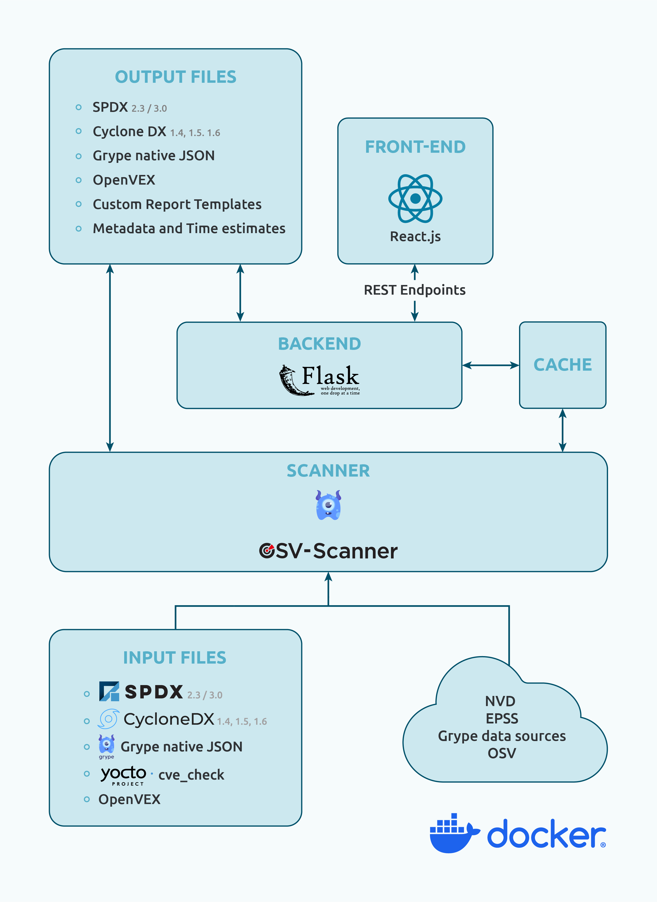

# VulnScout

**Savoir-faire Linux**

---

## Introduction

VulnScout is designed to analyse and identify vulnerabilities in software components and dependencies using an **SBOM (Software Bill Of Materials)**.

It pulls known vulnerabilities from public sources like the **NVD**, **EPSS**, and **Grype** to figure out which parts of a codebase might be affected by security issues (CVE).

VulnScout also provides a **web interface** for visualisation, triage and assessment, and a **command-line interface** to generate enriched output files.

### VulnScout Features

- Analyse SBOMs (SPDX 2/3, CycloneDX, Yocto CVE check, OpenVEX, Grype)
- Detect and enrich vulnerabilities from NVD, EPSS, and Grype
- Manage **projects and variants** for multi-target builds
- Web interface for visualisation, triage, and assessment
- Non-interactive / CI mode with configurable **match conditions**
- Generate customisable reports (AsciiDoc, HTML, PDF, CSV)
- Export enriched SBOMs (SPDX 3.0, CycloneDX 1.6, OpenVEX)
- Custom CVSS scoring per vulnerability
- Time estimation tracking for remediation effort
- Import and export custom assessments for backup and sharing

---

## Architecture

### Supported Input Files

- **SPDX 2.3** (Packages) — JSON and tag-value formats
- **SPDX 3.0** (Packages + vulnerabilities)
- **CycloneDX 1.4, 1.5, 1.6** (Packages + vulnerabilities)
- **Grype native JSON format** (Packages + vulnerabilities)
- **Yocto JSON output** of the `cve-check` module (Packages + vulnerabilities)

### Supported Output Files

- SPDX 2.3 (Packages)
- SPDX 3.0 (Packages + vulnerabilities)
- CycloneDX 1.4, 1.5, 1.6 (Packages + vulnerabilities)
- OpenVEX (vulnerabilities + assessments)

Reports:

- AsciiDoc
- HTML
- PDF

Other outputs:

- Summary: AsciiDoc, HTML, PDF
- Time estimates: CSV
- Vulnerabilities: CSV, TXT

---

### Vulnerability Data Sources

VulnScout pulls vulnerability and risk data from multiple trusted sources:

- **NVD (National Vulnerability Database)**
- All data sources supported by **Grype**
- **EPSS (Exploit Prediction Scoring System)**
- Information embedded in input files

---

### Custom CVSS Scoring

VulnScout allows you to add a **custom CVSS vector string** to a vulnerability, enabling organisation-specific vulnerability scoring.

---

## Licence

Copyright (C) 2017–2026 Savoir-faire Linux, Inc.

VulnScout is released under the **GPL-3.0 license**.

